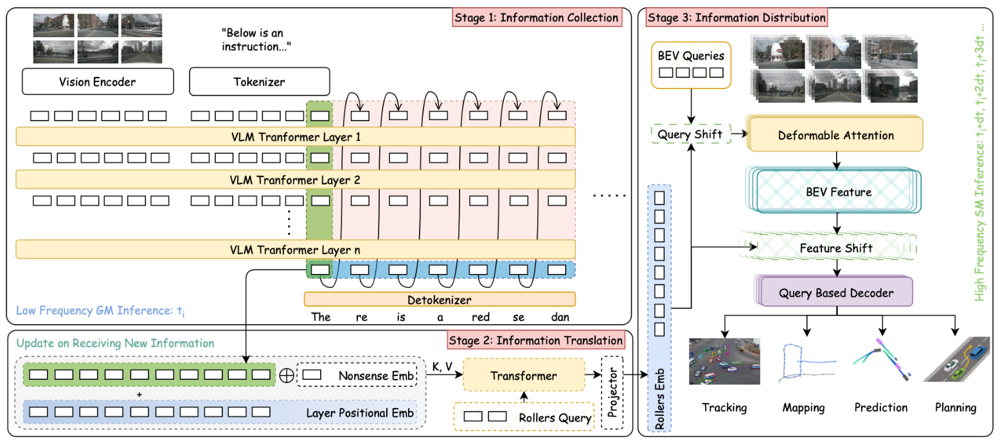
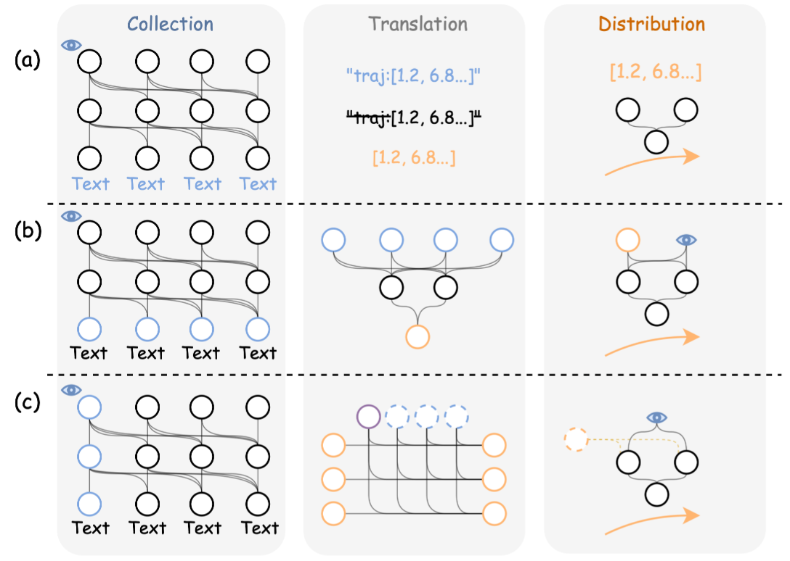
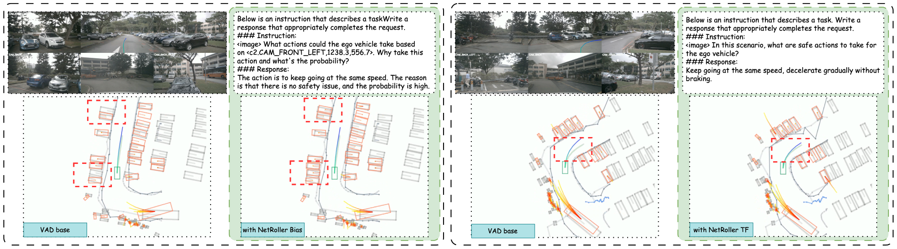
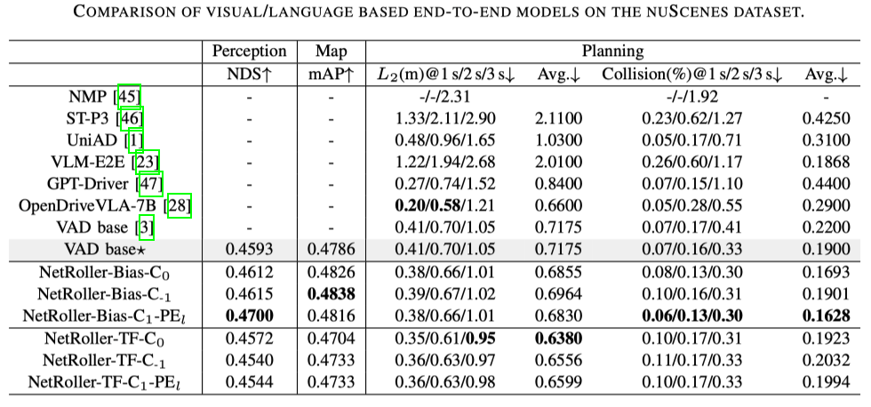

# NetRoller

This is the official repository of

**NetRoller: Interfacing General and Specialized Models for End-to-End Autonomous Driving**

[Ren Xin](https://rex-sys-hk.github.io), [Hongji Liu](http://liuhongji.site), [Xiaodong Mei](), [Wenru Liu](), [Maosheng Ye](), [Zhili Chen]() and [Jun Ma](https://personal.hkust-gz.edu.cn/junma/index.html)


<p align="left">
<a href="https://github.com/Rex-sys-hk/NetRoller">

</a>
<a href='https://arxiv.org/abs/2506.14589' style='padding-left: 0.5rem;'>
    
</a>
</p>




## Abstract

In this work, we explored the design of adapter to facilitate the seamless integration of Vision Language Models(VLMs, AKA. GMs) and Specialized driving Models(SMs). Specifically, key components of are organized into three key stages:
- Harvests semantically rich and computationally efficient representations from the reasoning processes of LLMs using an early stopping mechanism, which preserves critical insights on driving context while maintaining low overhead. 
- Applies learnable query embeddings, nonsensical embeddings, and positional layer embeddings to facilitate robust and efficient cross-modality translation.
- Employs computationally efficient Query Shift and Feature Shift mechanisms to enhance the performance of the driving model through few-epoch fine-tuning.

Based on the mechanisms formalized in these three stages, NetRoller enables specialized driving models to operate at their native frequencies while maintaining situational awareness of the VLMs.

Experiments conducted on the nuScenes dataset demonstrate that integrating GM through NetRoller significantly improves human similarity and safety in planning tasks, and it also achieves noticeable precision improvements in detection and mapping tasks for end-to-end autonomous driving.

## Concept Comparison with Exsting Methods


This diagram illustrates the evolution of the asynchronous frameworks between GMs and SMs. In mode **(a)**, the traditional approach involves generating textual information using GM, which is then parsed by regular expressions and displayed as received by the fast system. This method relies heavily on predefined patterns and interpretable explicit interfaces.
Some advanced studies have adopted mode **(b)**, where selected feature vectors from GMs are inter-modally generated as the latent variables required by SMs. This approach enhances the robustness of information across modalities but still faces challenges in accurately capturing the nuances of the feature vectors and establishing their relevance to SM.
We propose mode **(c)**, which fully leverages the latent variables generated during the reasoning process. These latent variables are extracted and robustly translated by a carefully designed module and can be applied to arbitrary targeted feature streams in SM. This method improves the efficiency and accuracy of information transfer, consequently enabling systems to handle complex tasks.


## Qualitative Comparison



Qualitative comparisons on perception and planning performance are presented. This comparison examines the vanilla VAD Base alongside its GM integration with the NetRoller Bias mode **(left)** and the TF mode **(right)**. By incorporating GM with NetRoller in Bias mode, it can be observed that the previously undetected vehicles on the left are captured with the assistance of GM. In contrast, when GM is introduced with NetRoller in TF mode, it is evident that SM plans a more human-like trajectory based on the instructions for longitudinal trajectory planning from the GM.

## Quantitative Comparison



## Setup Environment

Download and preprocess dataset following instructions from https://github.com/OpenDriveLab/DriveLM/blob/main/docs/data_prep_nus.md.

Setup conda/python environments by `pip install -r requirements.txt`, and follow instructions in `requirements.txt` file to install dependecies from about mmcv.


## Checkpoint

NetRoller Bias C1: [OneDrive](https://hkustconnect-my.sharepoint.com/:f:/g/personal/rxin_connect_ust_hk/EvmdGvvOmHVHuXfr4Hwi088BWdTl3z0mMqfUDEO9ZxUHLw?e=iXHz0i)

NetRoller TF C1: [OneDrive](https://hkustconnect-my.sharepoint.com/:f:/g/personal/rxin_connect_ust_hk/Etfx6wZzThhNtoU2OljECagBD7GTPxmElDOMCXNKZSYn0g?e=zRyIGd)

If the OneDrive links are expired please download them from the [HuggingFace](https://huggingface.co/rxinhkust/NetRoller/tree/main).

## Evaluation

`cd challenge/RollNet && bash rollnet_eval_local.sh <ckpt_folder_with_cfg>`


## To Do

The code is under cleaning and will be released gradually.

- [ ] Improve docs
- [ ] Cleaning up the repo
- [x] Tutorial
- [x] Evaluation
- [x] Checkpoint
- [x] Source
- [x] Initial repo & paper

The code and models will be made open-source gradually before the paper is accepeted.

## Citation

If you find this repo useful, please consider giving us a star 🌟 and citing our related paper.

```bibtex
@misc{netroller,
      title={{NetRoller:} Interfacing General and Specialized Models for End-to-End Autonomous Driving}, 
      author={Ren Xin and Hongji Liu and Xiaodong Mei and Wenru Liu and Maosheng Ye and Zhili Chen and Jun Ma},
      year={2025},
      eprint={2506.14589},
      archivePrefix={arXiv},
      primaryClass={cs.RO},
      url={https://arxiv.org/abs/2506.14589}, 
}
```

## Thanks
- [Circuit_Tracing](https://transformer-circuits.pub/2025/attribution-graphs/methods.html)
- [DriveLM](https://github.com/OpenDriveLab/DriveLM)
- [VAD](https://github.com/hustvl/VAD)

## Others
- The main body of code is located at `challenge/RollNet/projects/mmdet3d_plugin/rollnet`
